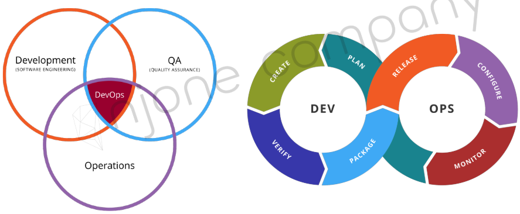

# 00. Microservice와 Spring Cloud의 소개

## Cloud Native Architecture
- 확장 가능한 아키텍처
  - 시스템의 수평적 확장에 유연
  - 확장된 서버로 시스템의 부하 분산, 가용성 보장
  - 시스템 또는, 서비스 애플리케이션 단위의 패키지 (컨테이너 기반 패키지)
  - 모니터링
- 탄력적 아키텍처
  - 서비스 생성 - 통합 - 배포, 비즈니스 환경 변화에 대응 시간 단축
  - 분할된 서비스 구조
  - 무상태 통신 프로토콜
  - 서비스의 추가와 삭제 자동으로 감지
  - 변경된 서비스 요청에 따라 사용자 요청 처리 (동적 처리)
- 장애 격리 (Fault isolation)
  - 특정 서비스에 오류가 발생해도 다른 서비스에 영향 주지 않음

## Cloud Native Application

- CI/CD
  - 지속적인 통합, CI(Continuous Integration)
    - 통합 서버, 소스 관리(SCM), 빌드 도구, 테스트 도구
    - ex) Jenkins, Team CI, Travis CI
  - 지속적 배포
    - **Continuous Delivery**
      - 지속적인 전달 (수동 반영)
    - **Continuous Deployment**
      - 지속적인 배포 (자동 반영)
    - Pipe line
  - 카나리 배포와 블루그린 배포
    
- DevOps
    
  - 자주 테스트하고 자주 피드백을 받고 자주 업데이트하는 과정을 거쳐 전체 개발일정이 완료될 때까지 지속적으로 끈임없이 진행하는 과정
- Container 가상화
  

## 12 Factors
- I. 코드베이스
  - 버전 관리되는 하나의 코드베이스와 다양한 배포
- II. 종속성
  - 명시적으로 선언되고 분리된 종속성
- III. 설정
  - 환경(environment)에 저장된 설정
- IV. 백엔드 서비스
  - 백엔드 서비스를 연결된 리소스로 취급
- V. 빌드, 릴리즈, 실행
  - 철저하게 분리된 빌드와 실행 단계
- VI. 프로세스
  -애플리케이션을 하나 혹은 여러개의 무상태(stateless) 프로세스로 실행
- VII. 포트 바인딩
  - 포트 바인딩을 사용해서 서비스를 공개함
- VIII. 동시성(Concurrency)
  - 프로세스 모델을 사용한 확장
- IX. 폐기 가능(Disposability)
  - 빠른 시작과 그레이스풀 셧다운(graceful shutdown)을 통한 안정성 극대화
- X. 개발/프로덕션환경 일치
  - 개발, 스테이징, 프로덕션 환경을 최대한 비슷하게 유지
- XI. 로그
  - 로그를 이벤트 스트림으로 취급
- XII. Admin 프로세스
  - admin/maintenance 작업을 일회성 프로세스로 실행
- [12 Factors](https://12factor.net/ko/)

## Monolithic vs Microservice

- Monolithic Architecture
  - 모든 업무 로직이 하나의 애플리케이션 형태로 패키지 되어 서비스
  - 애플리케이션에서 사용하는 데이터가 한 곳에 모여 참조되어 서비스 되는 형태
- Microservice Architecture
  - 함께 작동하는 작은 규모의 서비스
  - 비지니스 기능을 중심으로 구축
  - 완전하게 자동화된 배포 시스템을 사용
  - 각각의 최소한의 중앙 집중식 관리가 되어야 하고, 서로 다른 프로그래밍 언어와 데이터 저장 방식을 사용할 수 있다.

## SOA vs MSA
- SOA (Service Oriented Architecture)
  - 비즈니스 측면에서의 서비스 재사용성
  - ESB(Enterprise Service Bus) 라는 서비스 채널 이용 -> 서비스 공유, 재사용
- MSA (Microservice Architecture)
  - 한 가지 작은 서비스에 집중
  - **서비스 공유하지 않고 독립적 실행**
- SOA와 MSA와의 차이점
  - 서비스의 공유 지향점
    - SOA : 재사용을 통한 비용 절감
    - MSA : 서비스 간의 결합도를 낮추어 변화에 능동적으로 대응
  - 기술 방식
    - SOA : 공통의 서비스를 ESB에 모아 사업 측면에서 공통 서비스 형식으로 서비스 제공
    - MSA : 각 독립된 서비스가 노출된 REST API를 사용